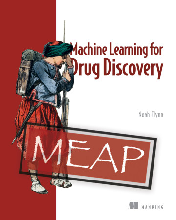

# Hi, I'm Noah

I'm a Senior Research Scientist at Google Cloud AI, working on Gemini Enterprise agentic systems for deep research, coding, and data science workflows. Previously, I was an Applied Scientist II at Amazon AWS AI Labs, where I worked on agentic AI, foundation model adaptation, long-context reasoning, and the Amazon Nova model family.

My work sits at the intersection of production AI systems, computational drug discovery, and teaching. I write at [noahrflynn.com](https://noahrflynn.com).

## What I'm working on

I'm writing and launching [Machine Learning for Drug Discovery](https://www.manning.com/books/machine-learning-for-drug-discovery?utm_source=flynn&utm_medium=affiliate&utm_campaign=book_flynn_machine_2_29_24&a_aid=flynn&a_bid=ddb44578&chan=mm_website), a hands-on Manning book about applying PyTorch, cheminformatics, graph neural networks, generative models, molecular dynamics, AlphaFold, and LLMs to real pharmaceutical problems.

All chapters are available in Manning MEAP. Use code `au35fly` for 35% off.

Companion code: [nrflynn2/ml-drug-discovery](https://github.com/nrflynn2/ml-drug-discovery)

 

I also teach graduate molecular science and software engineering at UC Berkeley. Selected public course materials are here: [nrflynn2/swe-molecular-sciences](https://github.com/nrflynn2/swe-molecular-sciences)

## Recent writing

I publish canonical posts on my site, then syndicate elsewhere.

<!-- BLOG-POST-LIST:START -->
| Date | Post |
| --- | --- |
| Apr 2026 | [what this site is for](https://noahrflynn.com/blog/2026/what-this-site-is-for/) |
<!-- BLOG-POST-LIST:END -->

Follow via [RSS](https://noahrflynn.com/feed.xml) or [Substack](https://substack.com/@noaflynn).

## Selected work

| Project | Notes |
| ------- | ----- |
| [Machine Learning for Drug Discovery](https://noahrflynn.com/book/) | Practical Manning book with real drug discovery case studies and PyTorch code |
| [DREAM](https://arxiv.org/abs/2602.18940) | Deep Research Evaluation with Agentic Metrics |
| [COMPASS](https://arxiv.org/abs/2604.20720) | Continual multilingual PEFT with adaptive semantic sampling, accepted at TMLR |
| [Amazon Nova](https://www.amazon.science/publications/the-amazon-nova-family-of-models-technical-report-and-model-card) | Technical report and model card for Amazon's Nova model family |
| [XenoSite](https://swami.wustl.edu/xenosite/) / XenoNet | Web tools and models for drug metabolism and toxicity prediction |
| [CHEM 274B](https://github.com/nrflynn2/swe-molecular-sciences) | UC Berkeley molecular science and software engineering course materials |

## Links

- Website: [noahrflynn.com](https://noahrflynn.com)
- Book: [Machine Learning for Drug Discovery](https://www.manning.com/books/machine-learning-for-drug-discovery?utm_source=flynn&utm_medium=affiliate&utm_campaign=book_flynn_machine_2_29_24&a_aid=flynn&a_bid=ddb44578&chan=mm_website)
- Publications: [Google Scholar](https://scholar.google.com/citations?user=KsUG8GgAAAAJ)
- LinkedIn: [noahflynn](https://www.linkedin.com/in/noahflynn/)

